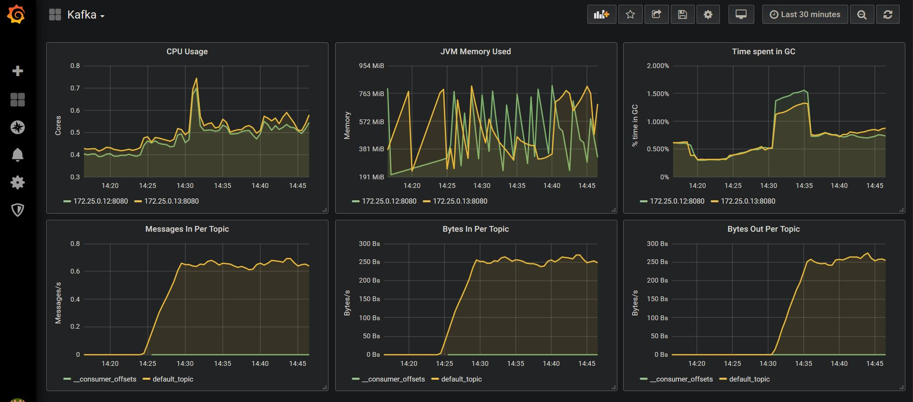
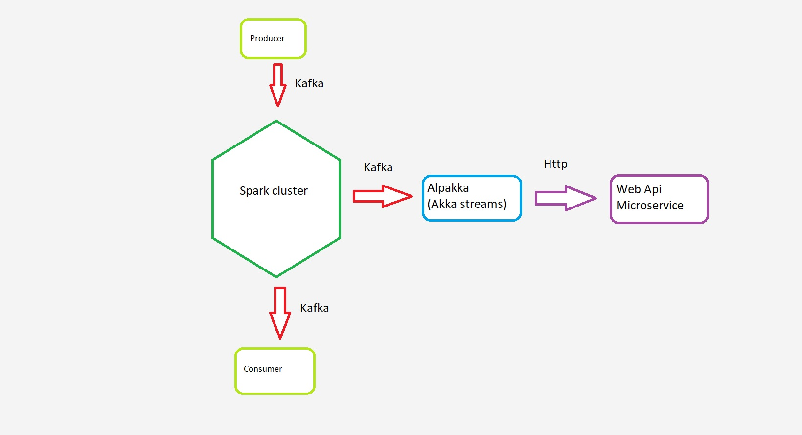

# Spark high-throughput non-blocking HTTP requests

The basic infrastructure (kafka cluster + manager, grafana, prometeus) was taken from [THIS-repo](https://github.com/EthicalML/kafka-spark-streaming-zeppelin-docker). Thank you!

## Overview:

<table>
<tr>
<td style="width: 100%">
<h2>Monitoring with grafana</h2>

</td>
</tr>
<td style="width: 100%">
<h2>Non blocking Spark</h2>

</td>
</table>

## Detail Summary

| Container | Image | Tag | Accessible | 
|-|-|-|-|
| zookeeper | wurstmeister/zookeeper | latest | 172.25.0.11:2181 |
| kafka1 | wurstmeister/kafka | 2.12-2.2.0 | 172.25.0.12:9092 (port 8080 for JMX metrics) |
| kafka1 | wurstmeister/kafka | 2.12-2.2.0 | 172.25.0.13:9092 (port 8080 for JMX metrics) |
| kafka_manager | hlebalbau/kafka_manager | 1.3.3.18 | 172.25.0.14:9000 |
| prometheus | prom/prometheus | v2.8.1 | 172.25.0.15:9090 |
| grafana | grafana/grafana | 6.1.1 | 172.25.0.16:3000 |
| dotnet | services/core.currency-api | latest | 172.25.0.22:9000/currency |
| alpakka | services/alpakka.http.consumer | latest | - |

# Quickstart


## Running Docker Compose


```
docker-compose up
```

This will run deattached. If you want to see the logs, you can run:

```
docker-compose logs -f -t --tail=10
```

To see the memory and CPU usage (which comes in handy to ensure docker has enough memory) use:

```
docker stats
```

## Basic architecture

#### Non-blocking requests


The basic idea was to avoid constucions like `Await.result(request, 0 nanos)' withing Spark execution environment. Instead of this Kafka queue with Alpakka were used.
Spark is playing role of messages mediator, but it could do some transformations (joins, maps, aggs and etc) in real-world solution.
Apache spark cluster just put messages asynchronously in the queue where Alpakka will process them.
Producer ===> Spark ===> Alpakka ===> WebApi (dotnet core).
Entire pipeline is aschronous , concurrent and non-blocking from the top to bottom.


### 2) Monitor Kafka

We can now use the kafka manager to dive into the current kafka setup.

#### Setup Kafka Manager

To set up kafka manager we need to configure it. In order to do this, access http://172.25.0.14:9000/addCluster and fill up the following two fields:

* Cluster name: Kafka
* Zookeeper hosts: 172.25.0.11:2181

Optionally:
* You can tick the following;
    * Enable JMX Polling
    * Poll consumer information

#### Access the topic information

If your cluster was named "Kafka", then you can go to http://172.25.0.14:9000/clusters/Kafka/topics/default_topic, where you will be able to see the partition offsets. Given that the topic was created automatically, it will have only 1 partition.


#### Visualise metrics in Grafana

Finally, you can access the default kafka dashboard in Grafana (username is "admin" and password is "password") by going to http://172.25.0.16:3000/d/xyAGlzgWz/kafka?orgId=1


