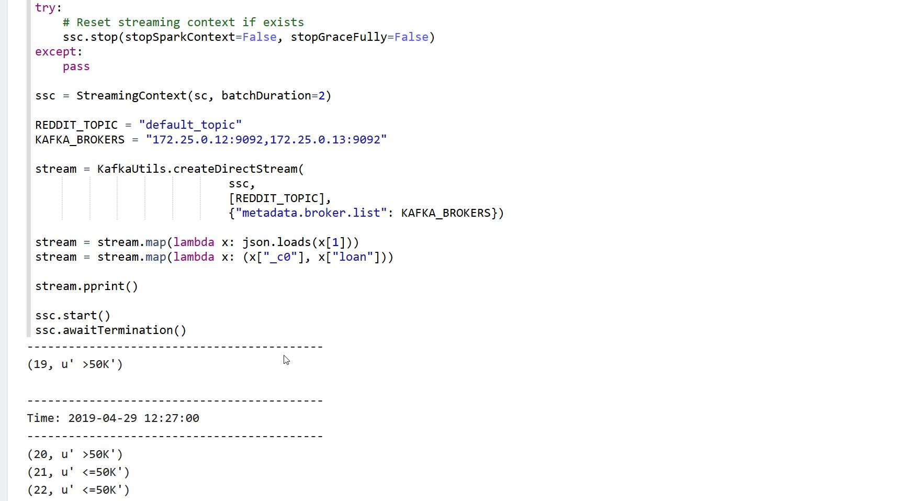

# Spark high-throughput non-blocking HTTP requests

The basic infrastructure (kafka cluster + manager, grafana, prometeus) was taken from [THIS-repo](https://github.com/EthicalML/kafka-spark-streaming-zeppelin-docker). Thank you!

## High level features:

<table>
<tr>
<td style="width: 50%">
<h2>Monitoring with grafana</h2>

</td>
<td style="width: 50%">
<h2>Kafka access from host</h2>

</td>
</tr>
<td style="width: 50%">
<h2>Multiple spark interpreters</h2>

</td>
</table>

## Detail Summary

| Container | Image | Tag | Accessible | 
|-|-|-|-|
| zookeeper | wurstmeister/zookeeper | latest | 172.25.0.11:2181 |
| kafka1 | wurstmeister/kafka | 2.12-2.2.0 | 172.25.0.12:9092 (port 8080 for JMX metrics) |
| kafka1 | wurstmeister/kafka | 2.12-2.2.0 | 172.25.0.13:9092 (port 8080 for JMX metrics) |
| kafka_manager | hlebalbau/kafka_manager | 1.3.3.18 | 172.25.0.14:9000 |
| prometheus | prom/prometheus | v2.8.1 | 172.25.0.15:9090 |
| grafana | grafana/grafana | 6.1.1 | 172.25.0.16:3000 |
| dotnet | services/core.currency-api | 0.0.1 | 172.25.0.22:9000/currency |
| alpakka | services/alpakka.http.consumer | 0.0.1 | - |

# Quickstart


## Running Docker Compose


```
docker-compose up
```

This will run deattached. If you want to see the logs, you can run:

```
docker-compose logs -f -t --tail=10
```

To see the memory and CPU usage (which comes in handy to ensure docker has enough memory) use:

```
docker stats
```

## Accessing the notebook

You can access the default notebook by going to http://172.25.0.19:8080/#/notebook/2EAB941ZD. Now we can start running the cells.

### 1) Setup

#### Install python-kafka dependency


### 4) Monitor Kafka

We can now use the kafka manager to dive into the current kafka setup.

#### Setup Kafka Manager

To set up kafka manager we need to configure it. In order to do this, access http://172.25.0.14:9000/addCluster and fill up the following two fields:

* Cluster name: Kafka
* Zookeeper hosts: 172.25.0.11:2181

Optionally:
* You can tick the following;
    * Enable JMX Polling
    * Poll consumer information

#### Access the topic information

If your cluster was named "Kafka", then you can go to http://172.25.0.14:9000/clusters/Kafka/topics/default_topic, where you will be able to see the partition offsets. Given that the topic was created automatically, it will have only 1 partition.



#### Visualise metrics in Grafana

Finally, you can access the default kafka dashboard in Grafana (username is "admin" and password is "password") by going to http://172.25.0.16:3000/d/xyAGlzgWz/kafka?orgId=1


